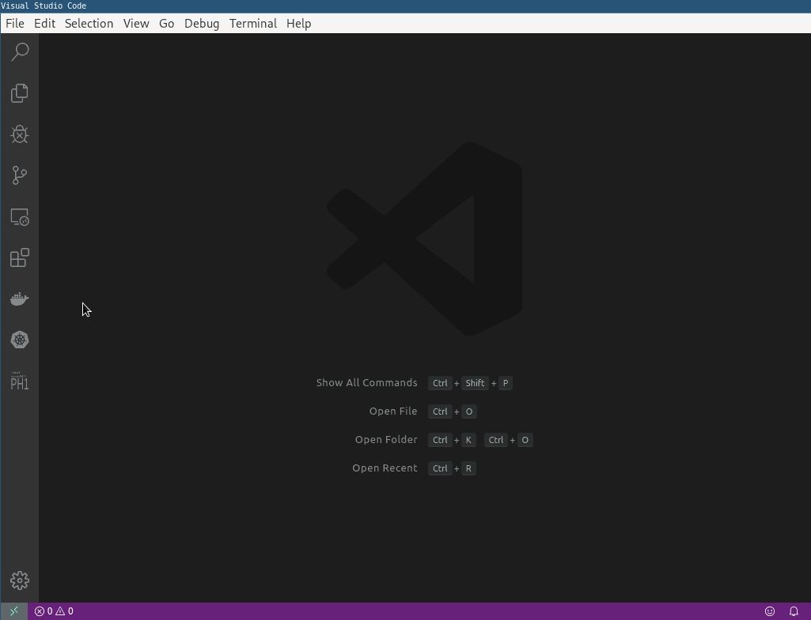
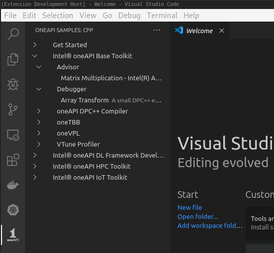

# Intel® oneAPI Sample Browser

## Draft - Some content here needs updating with final logos etc. (tcingleb)

A simple extension for viewing code samples availible for Intel oneAPI.
Leverages cross platform `oneapi-cli` to get the sample index and contents.



## Functionality

* View availible samples in Intel oneAPI, and lets you download them.
* Check dependecies are installed for sample

## Contrbuting 
Install Visual Studio Code (at least version 1.40) and open this project within it.
You may also need `yarn` installed, and of course `node + npm`

```bash
npm install -g yarn
yarn install
code .
```

At this point you should be able to run the extension in the "Extension Development Host"




## License
This extension is released under MIT.
Some resources such as icons may have other applicable liceses