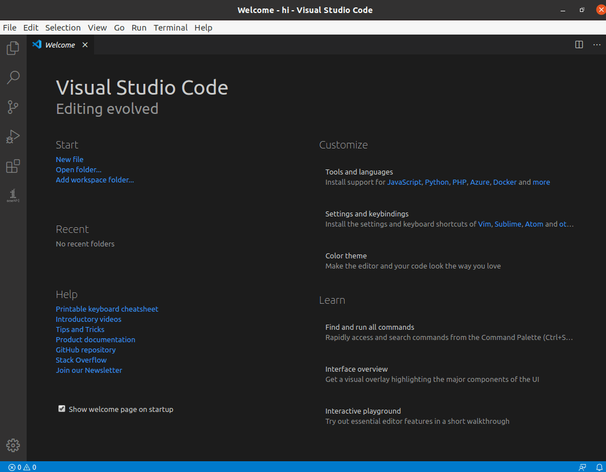

# Sample Browser for Intel oneAPI Toolkits

A simple extension for viewing code samples available for Intel oneAPI toolkits.
Leverages cross platform `oneapi-cli` to get the sample index and contents.



## Functionality

* View available samples from Intel oneAPI toolkits, and lets you download them.
* Check dependencies are installed for a sample.

Video demo - [Exploring oneAPI Samples with the Sample Browser in Visual Studio Code](https://youtu.be/hdpcNBB2aEU)

## Where to find Intel oneAPI toolkits.

This extension does not provide any of the tools that may be required to compile/run the sample.

Please visit https://software.intel.com/en-us/oneapi for details. For more information on how to use Visual Studio Code with Intel oneAPI toolkits please visit [Using VS Code with Intel oneAPI toolkits](https://software.intel.com/content/www/us/en/develop/documentation/using-vs-code-with-intel-oneapi/top.html)

## Contributing 
Install Visual Studio Code (at least version 1.42) and open this project within it.
You may also need `yarn` installed, and of course `node + npm`

```bash
npm install -g yarn
yarn install
code .
```

At this point you should be able to run the extension in the "Extension Development Host"

## License
This extension is released under MIT.
